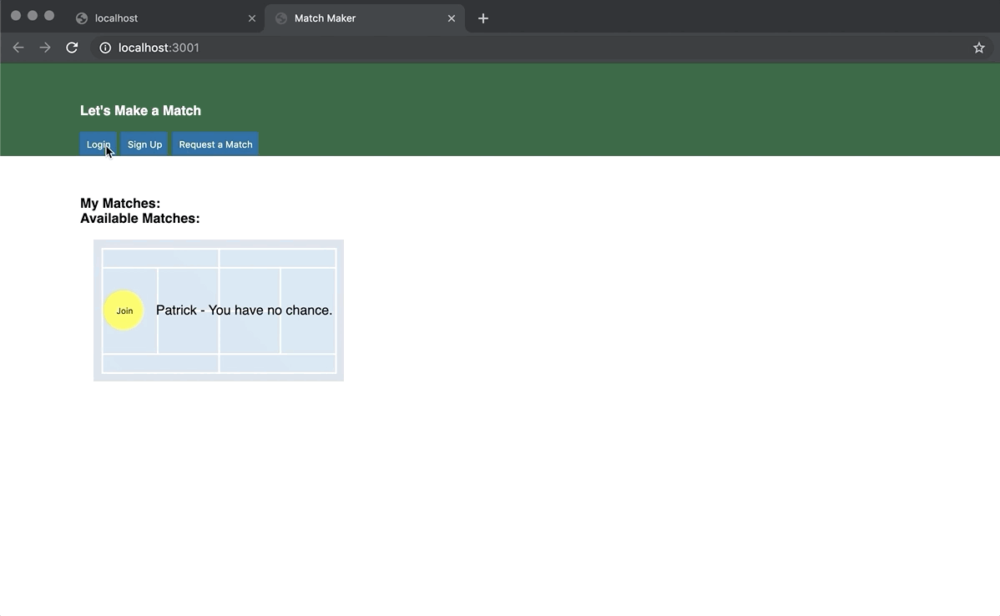
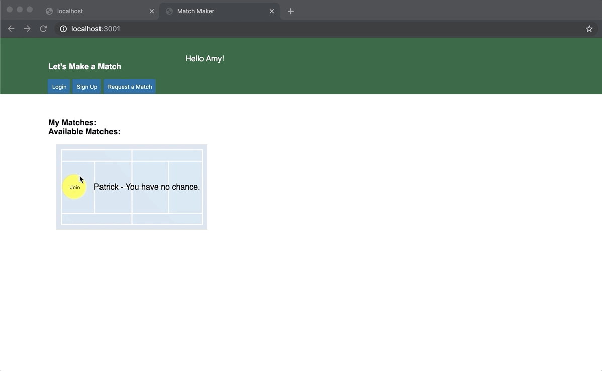

# scoreKeeperFrontEnd

#Match Maker
Match Maker is an HTML, CSS, and Javascript single page application that allows users to make and schedule tennis matches.

## Installation
To get this app up and running simply fork and clone the repo and run with a [lite-server](https://www.npmjs.com/package/light-server).

## Demo

### Create an Account

### Request Matches

### Returning Users Login

### Join Available Matches
